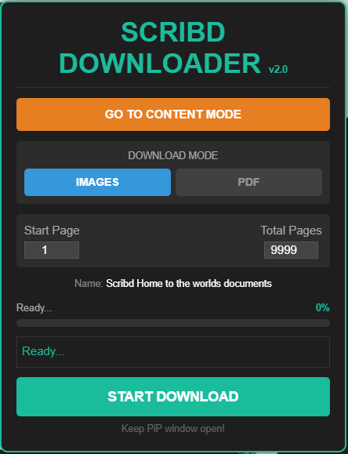
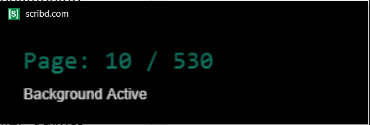

# Scribd Downloader

A versatile tool to download books and documents from Scribd embeds, supporting both Image and PDF formats. This tool works without a Premium account for documents that are available in embed mode.

## Features

-   **Dual Download Modes**:
    -   **Images**: Downloads each page as a high-quality JPEG image.
    -   **PDF**: Automatically compiles all pages into a single PDF file (requires waiting for all pages to load).
-   **Non-Intrusive**: The button now acts as a **toggle**. Click once to open, click again to close.
-   **Page Restricted**: The script is now restricted to document pages and embeds. It will **not** appear on search, browse, or explore pages.
-   **Integrated**: Clicking the button launches the same powerful downloader control panel you are used to.
-   **Resume Capability**: Can resume downloads if interrupted (mostly for Image mode).
-   **PiP Support**: Uses a Picture-in-Picture hack to keep the script running even when the tab is in the background.

## Disclaimer

> [!IMPORTANT]
> **Educational Purpose Only**: This tool is intended for educational purposes and for downloading documents you have the right to access (e.g., public domain content or "Open" documents).
>
> **Respect Copyright**: Do not use this tool to download copyrighted material that you do not own or have permission to use. The authors are not responsible for any misuse of this tool.

## Usage

### Method 1: Tampermonkey / Greasemonkey (Recommended)

This is the easiest way to use the downloader persistently.

1.  Install the [Tampermonkey](https://www.tampermonkey.net/) extension for your browser.
2.  Install the script: [**Click here to install**](scribd.user.js) (or manually create a new script and paste the content of `scribd.user.js`).
3.  Go to any Scribd document page.
4.  Look for a floating **Download** button at the bottom right of the screen.
5.  Click it to **toggle** (open/close) the Downloader panel.

### Method 2: Bookmarklet

1.  Create a new bookmark in your browser.
2.  Name it "Scribd Downloader".
3.  In the URL/Address field, paste the entire content of `Scribd Downloader Bookmark.txt`.
4.  When viewing a Scribd document, click the bookmark to launch the tool.

### Method 3: Console

1.  Open the Developer Tools (F12 or Ctrl+Shift+I).
2.  Go to the **Console** tab.
3.  Paste the code from `Scribd Downloader.txt` and press Enter.
4.  The panel will appear on the page.

## How to Use

1.  **Launch the tool** using one of the methods above.
2.  **Select Mode**: Choose between `IMAGES` or `PDF`.
3.  **Set Range**: You can adjust the Start and End page numbers if you only want a specific section.
4.  **Start Download**: Click the **START DOWNLOAD** button.
5.  **Important**: A Picture-in-Picture (PiP) window will open. **Do not close this window!** It keeps the script running smoothly even if you switch tabs.

## License

This project is licensed under the MIT License - see the [LICENSE](LICENSE) file for details.
